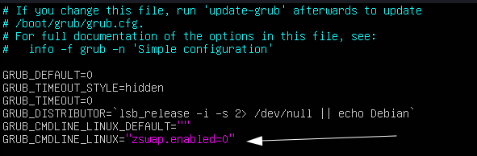
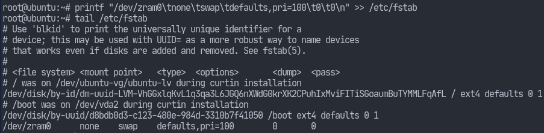
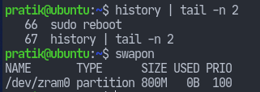

ZRAM as swap on Ubuntu 22
=========================

### Introduction

zram is a kernel module in which data written to the device nodes it creates are compressed and stored in memory itself . This is similar to `tmpfs` in which one could mount a directory as tmpfs and the data would be stored in memory rather than on disk. One obvious reason to use this is performance (due to faster disk I/O). Additionally, since `zram` also has compression features, we might as well replace it with all of our `tmpfs`.  
This article concerns with one of the various ways we can improve performance on Linux. As such, it shouldn’t be tied to a specific Linux distribution. The reason for the title is that’s the system I am using to test stuff out at the moment. Not to mention, I also don’t want to be bothered if this doesn’t work on some (probably obscure) distro.  
The default installation of Ubuntu 22.04 uses a swap file (`/swap.img`) which provides me a good opportunity to replace it with `zram`.

### Enabling ZRAM Temporarily

Enabling zram may cause conflicts with [zswap](https://wiki.archlinux.org/title/Zswap), which is enabled by default. So we need to firstly disable it.

`# echo 0 > /sys/module/zswap/parameters/enabled`

Now we can load the zram module.

`# modprobe zram`

We should be able to find a device node named `/dev/zram0`. Let’s allocate a size for it.

`# echo 800M > /sys/block/zram0/disksize`

Now we can format this device as if it was just a normal disk partiition we designated for swap.  
`# mkswap --label zram0 /dev/zram0`  
`# swapon -p 100 /dev/zram0`

### Enabling ZRAM Permanently

Although there are some tools that can make this easier, I want this to work on most distros. Therefore, we proceed with the manual way which requires no extra packages to make it work.

As before, we first need to disable `zswap`. This can be done permanently through kernel parameters. Modify `/etc/default/grub` so that it looks like the following.

`GRUB_CMDLINE_LINUX="zswap.enabled=0"`

Disabling Zswap permanently

Make sure to run `update-grub` to update the bootloader config files.

Now, we can make it so that the `zram` module is loaded at boot.

`# echo "zram" > /etc/modules-load.d/zram.conf`

Now, let’s set the number of devices we need. If I were to be using `zram` for other tmpfs directories like `/tmp` as well, then I’d have to increase this number.

`# echo "options zram num_devices=1" > /etc/modprobe.d/zram.conf`

Now let’s create a udev rule so that our device node is formatted automatically as swap.

`cat > /etc/udev/rules.d/99-zram-rules
KERNEL=="zram0", ATTR{disksize}="800M" RUN="/usr/sbin/mkswap -L zram0 /dev/zram0", TAG+="systemd"`

Creating udev rules for zram

Now all we need to do is add that device to our `/etc/fstab`. We’ll obviously also need to remove the already existing swapfile entry. Additionally, we can give the `pri=value` as an option to the swap entry.  
`# printf "/dev/zram0\tnone\tswap\tdefaults,pri=100\t0\t0\n" >> /etc/fstab`

Adding entry to /etc/fstab

Finally, we can reboot and see that our swap device is indeed active.

Swap is active after reboot
